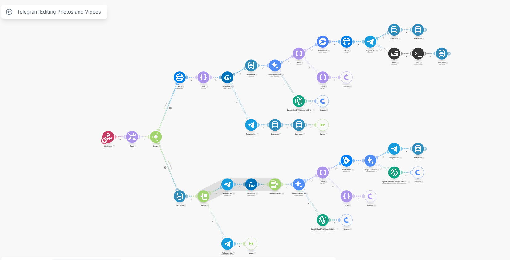

# 🤖 Automated Video and Image Editing for Car Dealerships

This project automates the creation of promotional videos and images for used cars, receiving content via Telegram, processing media with AI and no-code tools, and delivering the edited material directly to the sales team on Telegram.

---

## 📌 Client Challenge

The dealership has over **600,000 followers on Instagram** and receives **hundreds of cars per month** for promotion. The volume was so high that the marketing team couldn’t keep up with manually editing:

- ~250 videos/month  
- ~250 images/month  

They needed an automated, scalable, and easy-to-use solution to produce high-quality content with **minimal human effort**.

---

## ✅ Results Achieved

- ⏱️ **Saved 1 to 2 hours of manual work per day**
- 📉 **Reduced total editing time by up to 20%**
- 🚀 Faster publication of new cars on Instagram
- 🔁 Process now replicable and scalable

---

## 🧠 How It Works

1. **Content Submission via Telegram Bot**: The team sends images and/or videos of a car along with text or audio describing the vehicle.
2. **Reception and Storage (Make)**: The content is processed by a scenario in Make, which stores the media IDs.
3. **Processing**:
   - Text or audio is converted into a written description (via AI).
   - Media files are downloaded and uploaded to Cloudinary (for public URLs).
   - AI generates a commercial text to be used in captions and marketing assets.
   - Images are edited via **Renderform** and videos via **Creatomate**.
4. **Final Delivery**: The edited content is automatically sent back to Telegram.

---

## ⚙️ Technologies and Tools

| Step                | Technology                  |
|---------------------|-----------------------------|
| Data Input          | Telegram Bot + Webhook      |
| Automation          | Make (ex-Integromat)        |
| AI (Text and Audio) | Gemini, OpenAI GPT-4o, Whisper |
| Media Storage       | Cloudinary API              |
| Image Editing       | Renderform                  |
| Video Editing       | Creatomate                  |
| Final Distribution  | Telegram API                |

---

## 🚨 Overcoming Telegram Limitations

Telegram limits public API video downloads to 20MB. To overcome this:

- We created an **EC2 (T4g.medium) instance** on AWS.
- Installed the **Telegram Bot API** locally.
- Configured an **Nginx server** to serve the files via URL.
- Now we can work with videos up to **2GB** with Creatomate.

---

## ☁️ EC2 Installation Script (Telegram Bot API + Nginx)

### 🧩 Open Source Dependency

This project uses the official Telegram Bot API repository as a base:

- 📦 **Telegram Bot API (self-hosted)**  
  [github.com/tdlib/telegram-bot-api](https://github.com/tdlib/telegram-bot-api)  
  Used to host a local instance and bypass Telegram public API limits, allowing video downloads up to 2GB.

The installation and startup process were based on the repository instructions, adapted to run on an AWS EC2 instance with Nginx support.

<details>
<summary>Click to view the full script</summary>

```bash
#!/bin/bash

# === CONFIGURABLE VARIABLES ===
USER="ubuntu" # <--- Change if needed
API_ID="YOUR_ID"
API_HASH="YOUR_HASH"
PORT_API=8081
PORT_NGINX=8082

# === Install dependencies ===
sudo apt update && sudo apt upgrade -y
sudo apt install -y nginx acl curl unzip wget build-essential git cmake inotify-tools \
  gperf zlib1g-dev libssl-dev

# === Create directory structure ===
sudo -u $USER mkdir -p /home/$USER/tdlib-data
sudo -u $USER mkdir -p /home/$USER/temp
cd /home/$USER

# === Clone and build telegram-bot-api ===
sudo -u $USER git clone --recursive https://github.com/tdlib/telegram-bot-api.git
cd /home/$USER/telegram-bot-api
sudo -u $USER mkdir build
cd build
sudo -u $USER cmake -DCMAKE_BUILD_TYPE=Release ..
sudo -u $USER cmake --build . --target install
sudo cp ./telegram-bot-api /usr/local/bin/

# === Create startup script ===
cat <<EOF | sudo tee /home/$USER/start-telegram-api.sh
#!/bin/bash
umask 0022
exec /usr/local/bin/telegram-bot-api \
  --api-id=$API_ID \
  --api-hash=$API_HASH \
  --local \
  --dir=/home/$USER/tdlib-data \
  --temp-dir=/home/$USER/temp \
  --http-port=$PORT_API
EOF

sudo chmod +x /home/$USER/start-telegram-api.sh
sudo chown $USER:$USER /home/$USER/start-telegram-api.sh

# === Fix directory permissions ===
sudo chown -R $USER:$USER /home/$USER

# === Create systemd service ===
cat <<EOF | sudo tee /etc/systemd/system/telegram-bot-api.service
[Unit]
Description=Telegram Bot API Server
After=network.target

[Service]
Type=simple
User=$USER
Group=www-data
WorkingDirectory=/home/$USER
ExecStart=/home/$USER/start-telegram-api.sh
Restart=on-failure
UMask=0022

[Install]
WantedBy=multi-user.target
EOF

sudo systemctl daemon-reload
sudo systemctl enable telegram-bot-api
sudo systemctl start telegram-bot-api

# === Apply ACLs ===
sudo setfacl -R -m u:www-data:rx /home/$USER/tdlib-data
sudo setfacl -R -d -m u:www-data:rx /home/$USER/tdlib-data

# === Create symbolic link ===
sudo ln -s "/home/$USER/tdlib-data/" /var/www/tgfiles

# === Create Nginx config ===
cat <<EOF | sudo tee /etc/nginx/sites-available/telegram-files
server {
    listen $PORT_NGINX;

    location /files/ {
        alias /var/www/tgfiles/;
        autoindex off;
        add_header Content-Disposition "attachment";
        access_log /var/log/nginx/telegram_files_access.log;
    }
}
EOF

sudo ln -s /etc/nginx/sites-available/telegram-files /etc/nginx/sites-enabled/
sudo nginx -t && sudo systemctl reload nginx

# === Adjust directory permissions ===
sudo chmod o+x /home /home/$USER /home/$USER/tdlib-data

# === Final Message ===
echo "✔️ Telegram Bot API started on port $PORT_API"
echo "✔️ Nginx serving files at: http://<IP>:${PORT_NGINX}/files/videos/file_X.MP4"
echo "⚠️ Remember to replace USER, API_ID, and API_HASH in the script"
```
</details>

## Example Flow in Make (Integromat)

