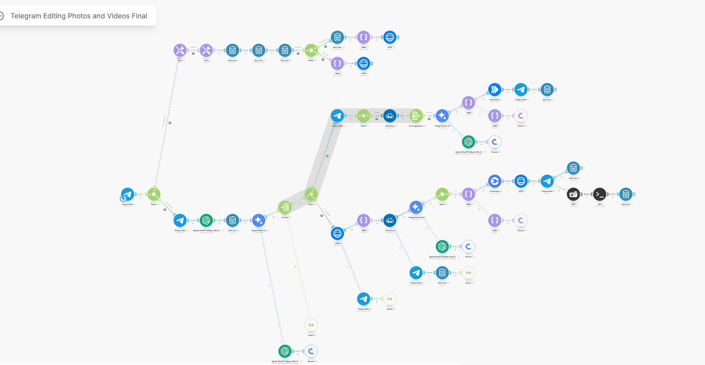
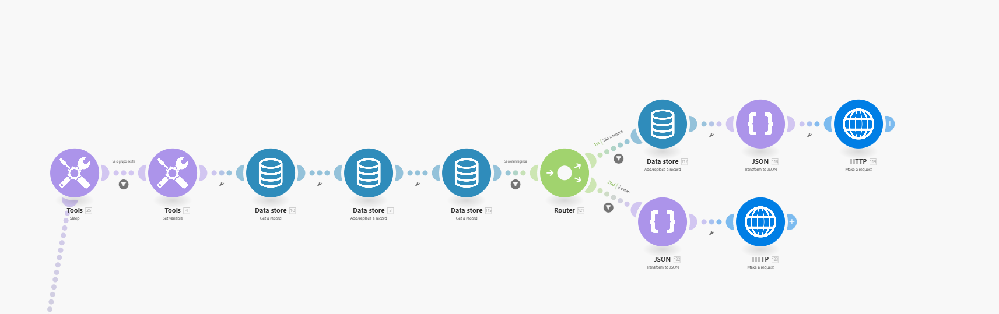
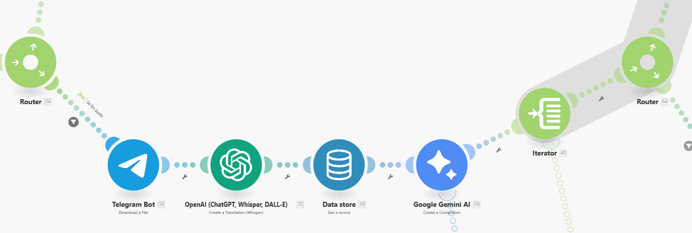
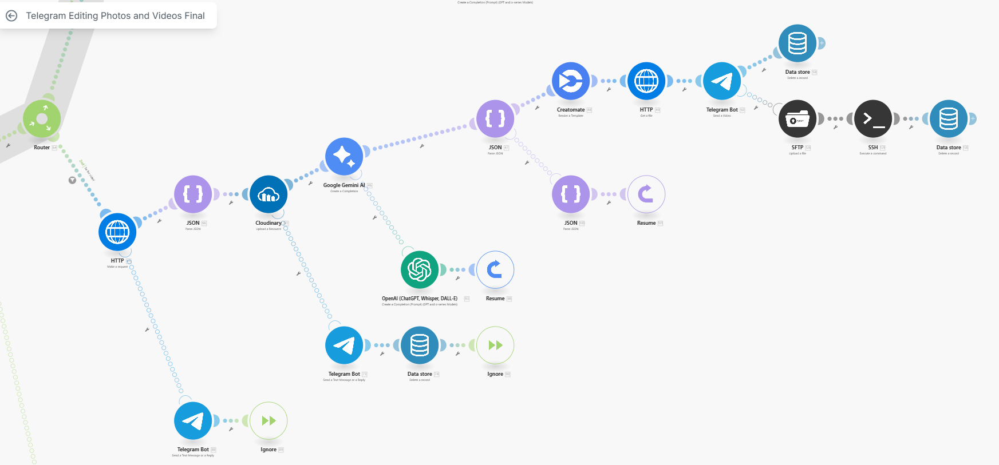
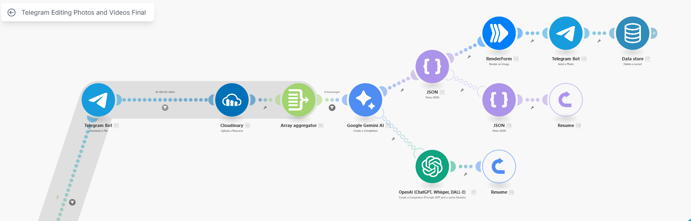
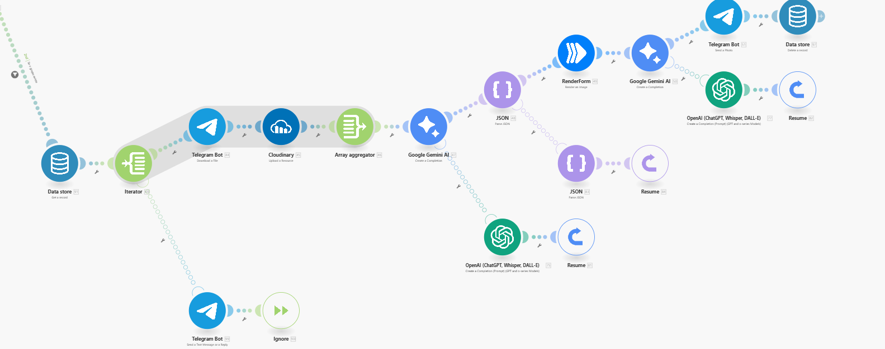
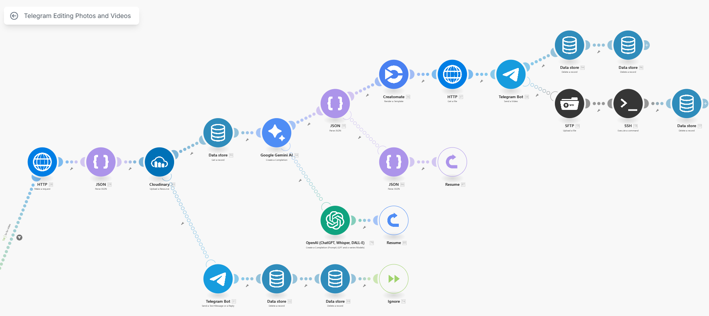
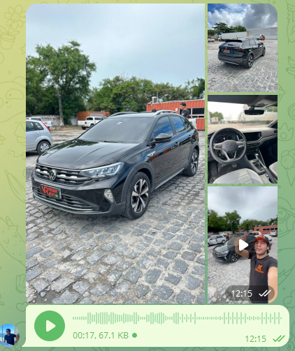
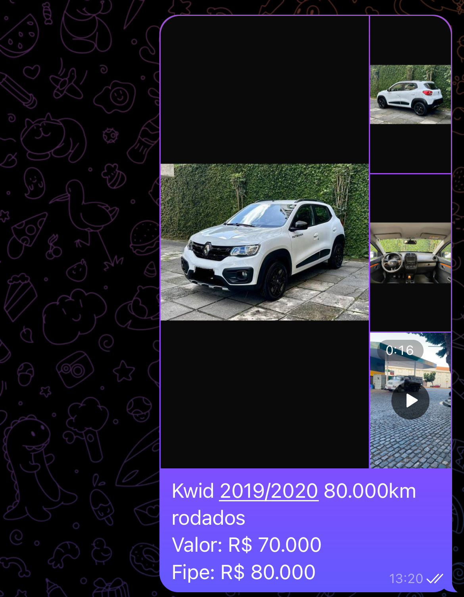
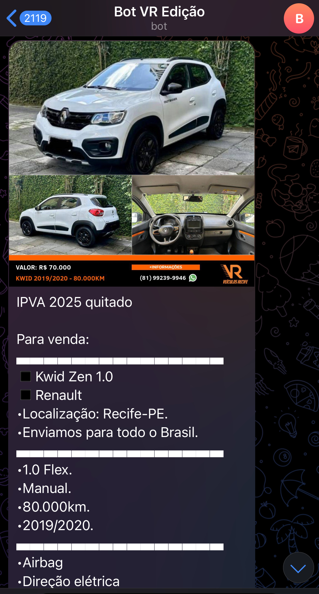

# 🤖 Automação de Edição de Vídeos e Imagens para Revendedoras de Carros

Este projeto automatiza a criação de vídeos e imagens promocionais para carros usados, recebendo conteúdos via Telegram, processando mídia com IA e ferramentas no-code, e entregando o material editado diretamente no Telegram da equipe comercial.

---

## 📌 Desafio do Cliente

A revendedora possui mais de **600 mil seguidores no Instagram** e recebe **centenas de carros por mês** para divulgação. O volume era tão grande que a equipe de marketing não conseguia dar conta da edição manual de:

- ~250 vídeos/mês
- ~250 imagens/mês

Eles precisavam de uma solução automatizada, escalável e fácil de usar para gerar conteúdos de alta qualidade com **mínimo esforço humano**.

---

## ✅ Resultados Obtidos

- ⏱️ **Redução de 1 a 2 horas de trabalho real por dia**
- 📉 **Diminuição de até 20% no tempo total de edição**
- 🚀 Agilidade na publicação de novos carros no Instagram
- 🔁 Processo agora replicável e escalável

---

## 🧠 Como Funciona

1. **Envio via Telegram Bot**: A equipe envia imagens e/ou vídeos de um carro, junto com texto ou áudio descrevendo o veículo.
2. **Recepção e Armazenamento (Make)**: O conteúdo é processado por um cenário no Make, que armazena os IDs das mídias.
3. **Processamento**:
   - Textos ou áudios são convertidos em descrição textual (via IA).
   - As mídias são baixadas, enviadas para o Cloudinary (geração de URL pública).
   - IA gera um texto comercial que será usado na legenda e nas artes.
   - Imagens são editadas via **Renderform** e vídeos via **Creatomate**.
4. **Entrega final**: O conteúdo editado é enviado automaticamente de volta ao Telegram.

---

## ⚙️ Tecnologias e Ferramentas

| Etapa               | Tecnologia                 |
|---------------------|----------------------------|
| Entrada de Dados    | Telegram Bot + Webhook     |
| Automações          | Make (ex-Integromat)       |
| IA Textual ou Audio         | Gemini e OpenAI GPT-4o  e Whisper            |
| Armazenamento Mídia | Cloudinary API             |
| Edição de Imagem    | Renderform                 |
| Edição de Vídeo     | Creatomate                 |
| Distribuição Final  | Telegram API               |

---

## 🚨 Superando Limitações do Telegram

O Telegram limita o download de vídeos em até 20MB pela API pública. Para contornar isso:

- Foi criada uma **instância EC2 (T4g.medium)** na AWS.
- Instalado o **Telegram Bot API** localmente.
- Servidor **Nginx** configurado para fornecer os arquivos por URL.
- Agora é possível trabalhar com vídeos de até **2GB** com Creatomate.

---

## ☁️ Script de Instalação EC2 (Telegram Bot API + Nginx)

### 🧩 Dependência de Código Aberto

Este projeto utiliza como base o repositório oficial do Telegram Bot API:

- 📦 **Telegram Bot API (self-hosted)**  
  [github.com/tdlib/telegram-bot-api](https://github.com/tdlib/telegram-bot-api)  
  Utilizado para hospedar uma instância local e contornar a limitação da API pública do Telegram, permitindo o download de vídeos de até 2GB.

A instalação e inicialização da API local foram feitas com base nas instruções desse repositório, adaptadas para rodar em uma instância EC2 da AWS com suporte ao Nginx.


<details>
<summary>Clique para ver o script completo</summary>

```bash
#!/bin/bash

# === CONFIGURAVEIS ===
USER="ubuntu" # <--- Trocar se necessário
API_ID="SEU ID"
API_HASH="SEU HASH"
PORT_API=8081
PORT_NGINX=8082

# === Instalar dependências ===
sudo apt update && sudo apt upgrade -y
sudo apt install -y nginx acl curl unzip wget build-essential git cmake inotify-tools \
  gperf zlib1g-dev libssl-dev

# === Criar estrutura de diretórios ===
sudo -u $USER mkdir -p /home/$USER/tdlib-data
sudo -u $USER mkdir -p /home/$USER/temp
cd /home/$USER

# === Clonar e compilar telegram-bot-api ===
sudo -u $USER git clone --recursive https://github.com/tdlib/telegram-bot-api.git
cd /home/$USER/telegram-bot-api
sudo -u $USER mkdir build
cd build
sudo -u $USER cmake -DCMAKE_BUILD_TYPE=Release ..
sudo -u $USER cmake --build . --target install
sudo cp ./telegram-bot-api /usr/local/bin/

# === Criar script de inicialização ===
cat <<EOF | sudo tee /home/$USER/start-telegram-api.sh
#!/bin/bash
umask 0022
exec /usr/local/bin/telegram-bot-api \
  --api-id=$API_ID \
  --api-hash=$API_HASH \
  --local \
  --dir=/home/$USER/tdlib-data \
  --temp-dir=/home/$USER/temp \
  --http-port=$PORT_API
EOF

sudo chmod +x /home/$USER/start-telegram-api.sh
sudo chown $USER:$USER /home/$USER/start-telegram-api.sh

# === Corrigir permissões do diretório principal ===
sudo chown -R $USER:$USER /home/$USER

# === Criar systemd service ===
cat <<EOF | sudo tee /etc/systemd/system/telegram-bot-api.service
[Unit]
Description=Telegram Bot API Server
After=network.target

[Service]
Type=simple
User=$USER
Group=www-data
WorkingDirectory=/home/$USER
ExecStart=/home/$USER/start-telegram-api.sh
Restart=on-failure
UMask=0022

[Install]
WantedBy=multi-user.target
EOF

sudo systemctl daemon-reload
sudo systemctl enable telegram-bot-api
sudo systemctl start telegram-bot-api

# === Aplicar ACLs ===
sudo setfacl -R -m u:www-data:rx /home/$USER/tdlib-data
sudo setfacl -R -d -m u:www-data:rx /home/$USER/tdlib-data

# === Criar link simbólico ===
sudo ln -s "/home/$USER/tdlib-data/" /var/www/tgfiles

# === Criar config do Nginx ===
cat <<EOF | sudo tee /etc/nginx/sites-available/telegram-files
server {
    listen $PORT_NGINX;

    location /files/ {
        alias /var/www/tgfiles/;
        autoindex off;
        add_header Content-Disposition "attachment";
        access_log /var/log/nginx/telegram_files_access.log;
    }
}
EOF

sudo ln -s /etc/nginx/sites-available/telegram-files /etc/nginx/sites-enabled/
sudo nginx -t && sudo systemctl reload nginx

# === Ajustar permissões dos diretórios ===
sudo chmod o+x /home /home/$USER /home/$USER/tdlib-data

# === Mensagem Final ===
echo "✔️ Telegram Bot API iniciado na porta $PORT_API"
echo "✔️ Nginx servindo arquivos em: http://<IP>:${PORT_NGINX}/files/videos/file_X.MP4"
echo "⚠️ Lembre-se de trocar USER,API_ID, API_HASH no script"
```
</details>

## Example Flow in Make (Integromat)









## Example Inputs on Telegram



## Example Output on Telegram with Audio


## Example Output on Telegram with Text


